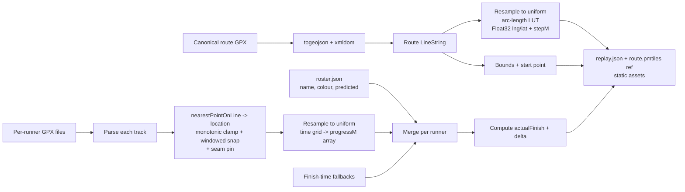
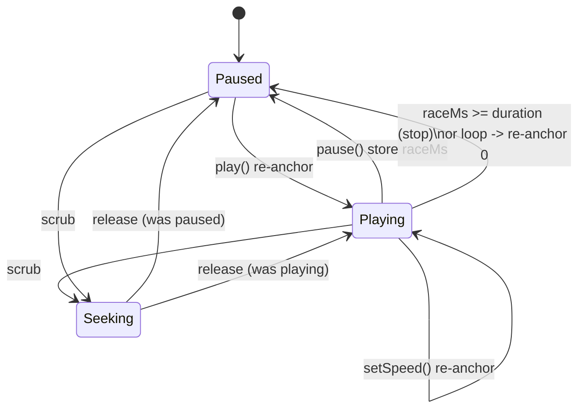

# feat: FCTC Cup 2026 Race-Replay Visualisation

## Summary

A published, replayable single-page web app that animates ~10–15 runners around the
7.74 km Herdsman Lake loop, each racing their own pre-predicted finish time. A faint
"ghost" marker sweeps the loop at each runner's constant predicted pace; a solid icon
of the same colour replays their real GPS, snapped to the canonical route. One shared
elapsed-time clock drives play/pause/scrub/speed. A leaderboard shows live Cup standings
(closest actual-to-predicted wins), and a synced gap chart shows every runner converging
toward their prediction. Data is baked at build time from GPX files (with a finish-time
fallback for missing tracks). Ships static on fctc.fun the morning after the race.

---

## Problem Frame

The FCTC Cup is a prediction race: the winner is whoever finishes closest to the time
they committed to beforehand, not the fastest runner (see origin:
`docs/brainstorms/2026-06-09-fctc-cup-visualisation-requirements.md`). The drama lives in
the second-by-second gap between predicted and actual, which a results table throws away.
This plan builds the replay that makes that gap watchable.

The work is greenfield (the repo contains only the canonical GPX and the brainstorm doc),
so there are no existing patterns to follow; architecture decisions are grounded in the
2026 research consolidated below rather than local convention.

---

## Key Technical Decisions

- **KTD1 — Vite + vanilla TypeScript, no React/Next.** This app is one map canvas, a
  master clock, a per-frame animation loop, and some UI chrome. Driving 60fps marker
  updates through a framework render cycle is a documented jank trap; the map/animation
  layer must stay imperative regardless. Vanilla TS keeps the hot path clean and the
  bundle tiny. (Note: this departs from the usual Next.js Vercel default, deliberately.)

- **KTD2 — `maplibre-gl@^5.24`.** Current stable. v6 is ESM-only, pre-release, and has no
  finalized migration guide as of early 2026; not worth gambling a fixed launch date on.

- **KTD3 — Self-hosted Protomaps PMTiles basemap, not a tile vendor.** The whole site is
  one fixed ~2.3 × 1.9 km view, so a single small `.pmtiles` extract of that bounding box
  ships as a static asset alongside the app. No API key, no rate limit, no third-party
  runtime dependency, full style control to match FCTC branding, and fastest possible
  load. MapTiler free tier is the documented fallback if the extract/style step proves
  fiddly. (Supersedes the OpenFreeMap option weighed during research.)

- **KTD4 — Deterministic, fully-precomputed, seekable playback — not a simulation.** Every
  marker position is a pure function of one scalar clock value. All geo math runs at build
  time and bakes into flat `Float32Array` lookups; Turf never runs in the browser. This
  makes seeking "set a number and render one frame" and keeps the runtime hot path to two
  array lerps + one batched layer update per runner per frame.

- **KTD5 — Anchor-pair clock, hand-rolled (~40 lines), no timeline/tween library and no
  fixed-timestep accumulator.** State is `(wallAnchor, raceAnchor, speed, playing)`;
  `raceMs = raceAnchor + (performance.now() - wallAnchor) * speed`. Play/pause/seek/speed
  are all re-anchoring operations. Clamp `raceMs` to `[0, durationMs]` for loop/stop.

- **KTD6 — One GeoJSON source + GL layers for all moving markers, batched `setData`/
  `updateData` once per frame; `icon-allow-overlap: true`.** DOM `Marker`s repositioned
  per frame are the mobile-jank trap. A single circle layer (data-driven colour) renders
  all dots; ghosts and trails are sibling layers. `icon-allow-overlap`/`text-allow-overlap`
  disables MapLibre's per-move symbol fade (a known flicker trap). DOM is used only for the
  *selected* runner's label (ATC-style declutter).

- **KTD7 — Map-matching at build with `nearestPointOnLine`, then monotonic clamp +
  windowed snap + seam pinning.** `properties.location` gives distance-along-route directly.
  Raw snaps jitter backward on noise and can teleport at the start/finish seam or
  self-intersections; the fix is enforce `progress[i] = max(progress[i], progress[i-1])`,
  constrain each snap to a window near the previous progress value, and pin `progress[0]=0`
  / final `=L`. This is the only genuinely fiddly algorithm; budget a build-script iteration
  and eyeball every snapped track before shipping.

- **KTD8 — Mixed-fidelity data, one runtime code path.** Ghosts (constant predicted pace)
  and finish-time-only icons (constant actual pace) are linear functions computed live
  (`L · clamp(t/T, 0, 1)`); only GPS runners get a baked `progressM` array. The render
  branch is "have `progressM`? lerp it : compute linear." A missing GPX never blocks launch.

- **KTD9 — Gap chart metric = running delta vs the runner's own prediction.** X = race
  elapsed time, Y = seconds ahead/behind that runner's ghost. Every line converges to its
  final Cup delta, so the chart visualises the Cup result forming. It doubles as the
  scrubber. (Chosen over "gap to leader," which misreads a prediction race.)

External research was load-bearing: it set the stack versions (KTD2), the basemap approach
(KTD3), the rendering primitive and the symbol-fade gotcha (KTD6), the map-matching pitfalls
(KTD7), and validated the whole concept against Strava Flyby and Racemap's "Ghost
Participant" feature. See **Sources & Research**.

---

## High-Level Technical Design

### Build-time data pipeline (Node, runs before `vite build`)



### Runtime architecture (browser)

```mermaid
flowchart TB
  JSON[replay.json] --> LOADER[Loader\n-> Float32Arrays]
  LOADER --> STATE[Replay state\nroute LUT, runners, durationMs]
  CLOCK[Anchor-pair clock\nperformance.now] --> RAF
  TRANSPORT[Transport UI\nplay/pause/scrub/speed] --> CLOCK
  GAP[Gap chart\nclick/drag to seek] --> CLOCK
  RAF[rAF tick: compute raceMs, clamp] --> EVAL
  STATE --> EVAL[Per runner: progress t\nghost=linear, icon=lerp progressM]
  EVAL --> COORD[progress -> route LUT lerp -> lng/lat]
  COORD --> RENDER[One batched setData:\ncircle layer + ghost layer + trail layer]
  EVAL --> UI[Throttled: leaderboard sort by |delta|,\nclock readout, gap-chart playhead]
  RENDER --> MAP[MapLibre, locked camera, Protomaps basemap]
```

### Playback clock states



---

## Motion & Interaction Design

Reviewed against Emil Kowalski's design-engineering principles. The guiding split: this app
has **two motion regimes** that obey opposite rules.

1. **Informational playback** (markers, ghosts, trails, gap-chart playhead sweeping with the
   clock). This is data, like video. Interpolate **linearly**; never apply easing to marker
   position — the run's real acceleration already lives in the GPS, and easing would falsify
   pace. This regime stays on under `prefers-reduced-motion` (it's the content).
2. **UI chrome** (transport, selection, leaderboard re-sort, bottom sheet, reveals). Standard
   craft rules: crisp, fast, GPU-only, custom easing.

**Personality:** athletic, precise, crisp — closer to a stopwatch than a soft Sonner toast.

**Shared tokens — cohesion, use everywhere, never one-off values:**
```css
--ease-out:   cubic-bezier(0.23, 1, 0.32, 1);   /* enter/exit, UI feedback */
--ease-move:  cubic-bezier(0.77, 0, 0.175, 1);  /* on-screen movement (re-sort) */
--ease-sheet: cubic-bezier(0.32, 0.72, 0, 1);   /* mobile drawer */
--dur-press: 140ms; --dur-ui: 180ms; --dur-move: 220ms; --dur-sheet: 320ms;
--dim: 0.3;   /* dimmed (non-selected) opacity — shared across map / leaderboard / gap chart */
```

**Performance floor (non-negotiable — shares a frame budget with MapLibre):** animate only
`transform`, `opacity`, `clip-path`. Never `all`; never width/height/margin/top/left. Prefer
CSS transitions / WAAPI over keyframes so interactions retarget instead of restarting.

**Playback & transport (U4):**
- Speed change is **instant** (re-anchor, no ramp). The active speed button gets a **sliding**
  indicator (clip-path tab technique), `--dur-ui --ease-out`.
- Scrub-drag is **direct** (playhead tracks the pointer, no smoothing) with **pointer capture**
  so the drag survives leaving the rail.
- Clicking a finish tick **tweens** `raceMs` to that time over ~250ms `--ease-out` so the field
  rushes to the moment instead of teleporting. Tween the clock only on discrete jumps, never on
  drag.
- Spacebar toggles play/pause: state flips instantly, icon swap ≤120ms, no movement anim (it's
  hammered during review — keep it weightless).
- Pause the rAF loop on `visibilitychange:hidden` so a backgrounded tab doesn't play through or
  burn battery.

**Markers, ghosts, trails (U5):**
- Ghost reads clearly secondary (translucent + hollow/ring); the solid icon is primary.
- If using a direction arrow, **smooth the heading** (damped lerp / spring on bearing, ~0.15) —
  raw GPS bearing twitches.
- Trail: **gradient** opacity (transparent tail → solid head), slight width taper, length fixed
  in race-time (~20–40s), linear. No constant-opacity sticks; never let trails accumulate into
  loop spaghetti.
- Initial marker entrance (page load, staged at the start line): **stagger** scale 0.9→1 +
  opacity, 40–60ms apart by runner. Never `scale(0)`. The race start is a true mass start — do
  **not** fake a stagger once the clock runs.

**Selection / highlight (U6):**
- Select → non-selected markers, rows, and gap-chart lines transition to `--dim` over
  `--dur-ui --ease-out`, the **same** token everywhere so the highlight ripples as one gesture.
- The selected runner's on-map label scales in from the marker (`transform-origin` at the
  marker, scale 0.95→1 + opacity, `--dur-ui --ease-out`). Gate hover behind
  `@media (hover: hover) and (pointer: fine)`.

**Leaderboard re-sort (U6):** when standings change, **FLIP-animate** row position
(`transform: translateY`, `--dur-move --ease-move`) so rows slide, never jump. Coalesce/cap
during fast playback so rapid finishes don't queue a backlog.

**Mobile bottom sheet (U6):** open/close on `--ease-sheet`; position via `translateY(%)`. Drag
with pointer capture, ignore secondary touches, **velocity dismissal** (flick > ~0.11 dismisses
regardless of distance), **friction** past the top boundary (no hard wall), scrim fades with
sheet progress.

**The two delight moments (U8) — seen once per visit, so spend budget here:**
- **Winner reveal:** the winning row **springs** to rank 1 (`spring duration 0.5 bounce 0.2`),
  🏆 pops in (scale 0.8→1 spring), a soft glow on the winner's marker + gap-chart line. Stop
  there — one or two high-impact beats, not confetti overload.
- **Start cue:** a restrained pulse on the start line as the clock engages. No cheesy 3-2-1.

**Reduced motion:** `prefers-reduced-motion` keeps the playback regime and dim/opacity/color
cues, but drops chrome *movement* — sheet slide → fade, re-sort FLIP → instant, winner spring →
opacity pop, trails optional. Fewer and gentler, not zero.

**Buttons everywhere:** `:active { transform: scale(0.97) }` at `--dur-press --ease-out`.

**Verify with fresh eyes and in slow motion** (2–5× duration in DevTools) before shipping —
timing flaws in the re-sort, the sheet, and the winner reveal are invisible at full speed.

---

## Output Structure

```
fctc-cup-2026/
├── Inaugural_FCTC_.gpx          # canonical route source (existing)
├── data/
│   ├── roster.json              # name, colour, predicted finish (hand-curated)
│   ├── tracks/                  # per-runner GPX dropped here race morning
│   │   └── <runner-id>.gpx
│   └── fallbacks.json           # finish-time-only runners (no GPX)
├── scripts/
│   ├── bake-data.ts             # orchestrates the build-time pipeline
│   ├── route.ts                 # GPX -> route LUT + bounds
│   ├── match.ts                 # GPS -> snapped monotonic progressM
│   └── extract-basemap.md       # one-time pmtiles extraction notes
├── public/
│   ├── replay.json              # baked output (gitignored or committed)
│   └── basemap.pmtiles          # Protomaps extract of the lake bbox
├── src/
│   ├── main.ts                  # bootstrap
│   ├── map.ts                   # MapLibre init, basemap, route line, layers
│   ├── clock.ts                 # anchor-pair playback clock
│   ├── engine.ts                # rAF loop, progress eval, batched render
│   ├── transport.ts             # play/pause/scrub/speed + scrubber ticks
│   ├── leaderboard.ts           # Cup standings, selection/highlight
│   ├── gapchart.ts              # synced delta-vs-prediction chart
│   ├── layout.ts                # responsive desktop panel / mobile sheet
│   ├── palette.ts               # runner colour assignment
│   └── types.ts                 # shared data shapes
├── tests/                       # Vitest specs (see per-unit Files)
├── vite.config.ts
├── vercel.json                  # only if SPA routing added
└── README.md
```

The per-unit `Files` sections are authoritative; the implementer may adjust layout.

---

## Requirements Traceability

Origin requirements `R1`–`R21` map to units as: map/route R1–R4 → U1, U2; predicted/actual
model R5–R8 → U3, U5; data ingestion R9–R12 → U2, U3; playback R13–R15 → U4; info/responsive
R16–R19 → U6; publishing R20–R21 → U1, U8. The gap chart and scrubber annotations (pulled
from origin "Deferred to Follow-Up" into v1 at the user's request) → U7, U4.

---

## Implementation Units

### U1. Project scaffold, basemap, and locked map canvas

**Goal:** A deployable Vite + TS app that renders the muted Protomaps basemap of Herdsman
Lake with the camera locked to the route bounds. Establishes the static-deploy skeleton.

**Requirements:** R1, R3, R4, R20, R21.

**Dependencies:** none.

**Files:** `package.json`, `vite.config.ts`, `tsconfig.json`, `index.html`, `src/main.ts`,
`src/map.ts`, `public/basemap.pmtiles`, `scripts/extract-basemap.md`, `tests/map.test.ts`.

**Approach:** Vite vanilla-TS template. Init MapLibre with `bounds` fitted to the route
bbox (from U2 once available; hardcode the known bbox initially), `maxBounds` clamp,
`interactive: false` (or pan-within-bounds + rotation disabled), tight `minZoom`/`maxZoom`.
Register the `pmtiles` protocol and point the style at `public/basemap.pmtiles` with a
Protomaps theme tuned dark/muted. Document the one-time pmtiles extraction in
`scripts/extract-basemap.md` (extract the lake bbox, verify file size, choose/customise the
theme). Keep MapLibre attribution control intact.

**Patterns to follow:** none local (greenfield); MapLibre `Map` constructor + `pmtiles`
protocol per official docs.

**Test scenarios:**
- Covers R3. Camera config: given the route bounds, the computed `fitBounds` + `maxBounds`
  produce a viewport centred on the loop and reject pan outside (unit-test the bounds helper).
- Map boot: the map fires `load` and the basemap source/style resolve without console errors
  (smoke test; may be manual given canvas/WebGL).
- `Test expectation: partial` — most of this unit is visual/integration; unit-test only the
  pure bounds/zoom helper, verify the rest manually in-browser.

**Verification:** `npm run dev` shows the lake, muted and centred, camera won't escape the
bbox, no console errors; `npm run build` emits a static `dist/` Vercel can serve.

---

### U2. Build-time route pipeline: canonical LUT + bounds

**Goal:** Parse the canonical GPX into a uniform arc-length lookup table (the shared route
geometry every marker rides) plus route bounds, start point, and total length.

**Requirements:** R2, R8, R11 (partial — route side).

**Dependencies:** U1.

**Files:** `scripts/route.ts`, `scripts/bake-data.ts`, `src/types.ts`, `tests/route.test.ts`.

**Approach:** With `@tmcw/togeojson` + `@xmldom/xmldom`, parse `Inaugural_FCTC_.gpx` → route
LineString. Use `@turf/length` to confirm ~7.74 km. Resample the line to a uniform
arc-length LUT (a coordinate every ~1 m → flat `Float32` `lng[]`/`lat[]` + `stepM`), so
`index = progressM / stepM` maps progress → coordinate by lerp. Emit route bounds and start
`[lng,lat]`. Pick the start vertex on an unambiguous straight segment to ease the seam
(KTD7). Write into the `route` section of `replay.json`. Also emit the route LineString as
GeoJSON for U1's route line layer.

**Patterns to follow:** none local; turf `along`/`length`, togeojson Node pattern (inject
`DOMParser` from `@xmldom/xmldom`).

**Test scenarios:**
- Covers R11. LUT correctness: a known distance (e.g. 0, L/2, L) maps via the LUT lerp to a
  coordinate within a tight tolerance of the turf `along` result.
- Length sanity: computed route length is within ~1% of 7.74 km.
- Closure: first and last LUT coordinates are within a few metres (closed loop).
- Uniform spacing: consecutive LUT samples are ~`stepM` apart (within tolerance).
- Edge: progress beyond `L` or below 0 clamps to the endpoints, not out-of-bounds index.

**Verification:** `replay.json` contains a `route` block; a scratch render of the LUT
overlays the real GPX track; length/closure assertions pass.

---

### U3. Build-time runner pipeline: ingestion, map-matching, mixed fidelity

**Goal:** Turn the roster + per-runner GPX (+ finish-time fallbacks) into baked per-runner
data: monotonic `progressM` arrays for GPS runners, computed finishes and deltas for all,
graceful degrade for missing tracks.

**Requirements:** R5, R7, R9, R10, R11, R12.

**Dependencies:** U2.

**Files:** `scripts/match.ts`, `scripts/bake-data.ts`, `data/roster.json`,
`data/fallbacks.json`, `src/palette.ts`, `tests/match.test.ts`.

**Approach:** Read `roster.json` (`{id, name, predicted, colour?}`). For each runner with a
GPX in `data/tracks/`: parse → for each GPS point `nearestPointOnLine(route, pt).location`
→ snapped distance. Enforce monotonicity (`max` scan), window each snap near the previous
progress to dodge self-intersection wrong-arm snaps and the start/finish seam, pin
`progress[0]=0` and final `=L`. Resample onto a uniform race-elapsed-time grid (`dtMs`,
1 s native) → `progressM` Float32 array. Derive `actualFinishMs` (time progress reaches L).
For runners in `fallbacks.json` (finish time only) or with no usable GPX: set
`hasGps:false`, no `progressM` (runtime treats as linear to `actualFinishMs`). Compute
`deltaMs = actualFinish − predicted`. Assign colours from `palette.ts` if not in roster.
`durationMs = max(all actual finishes, all predicted finishes)` (R15). Write `runners` into
`replay.json`.

**Execution note:** Build characterization-style assertions against the real
`Inaugural_FCTC_.gpx` track first (it's a known-good single lap) before layering noise
handling — it's the one track we can eyeball end to end.

**Patterns to follow:** turf `nearestPointOnLine` (`.location` = along-distance, `.dist` =
perpendicular offset for outlier rejection).

**Test scenarios:**
- Covers R11. Monotonicity: a synthetic track with an injected backward-noise point yields a
  non-decreasing `progressM`.
- Covers R11. Seam: a point near the start that geometrically snaps to ~L is corrected to
  ~0 (no full-lap teleport).
- Self-intersection window: a point near a loop crossing snaps to the arm consistent with
  the runner's prior progress, not the far arm.
- Covers R10. Missing GPX: a roster entry with no track and a fallback finish time produces
  `hasGps:false`, no `progressM`, correct `actualFinishMs`/`deltaMs`.
- Covers R10. No data at all: a runner with neither GPX nor fallback is emitted as
  `noData` (or omitted) and the build still succeeds.
- Delta + duration: `deltaMs` sign/magnitude correct; `durationMs` equals the latest of all
  actual and predicted finishes.
- Resampling: `progressM` length equals `round(actualFinishMs / dtMs)` and ends at ~L.

**Verification:** running `bake-data` against the canonical GPX plus a couple of synthetic
tracks produces a valid `replay.json`; every snapped track overlays its raw GPX cleanly when
eyeballed.

---

### U4. Playback clock + transport controls + scrubber annotations

**Goal:** The anchor-pair clock and the transport UI: play/pause, scrub, speed, loop, plus
semantic tick marks on the scrubber rail.

**Requirements:** R13, R14, R15 (+ scrubber annotations, pulled into v1).

**Dependencies:** U1 (can develop against a stub duration before U3 data lands).

**Files:** `src/clock.ts`, `src/transport.ts`, `tests/clock.test.ts`.

**Approach:** `clock.ts` holds `(wallAnchor, raceAnchor, speed, playing)` and exposes
`raceMs()`, `play()`, `pause()`, `seek(ms)`, `setSpeed(x)`, all as re-anchoring ops, with a
clamp to `[0, durationMs]`. `transport.ts` renders the bar: play/pause toggle, a scrub
slider bound to `seek`, speed buttons (1×, 5×, 15×, 30×; default ~15× so a ~45 min race
plays in ~3 min, with the option to speed up — research warns 60× feels rushed), and a
clock readout written by direct DOM (not per-frame framework state). Place tick marks on the
scrub rail at each runner's finish time, with the winner's finish flagged. See **Motion &
Interaction Design** for transport motion: instant speed change with a sliding indicator,
clock-tween on finish-tick jumps (direct on drag), pointer capture, weightless spacebar, and
the `visibilitychange` pause.

**Patterns to follow:** none local; `performance.now()` monotonic clock.

**Test scenarios:**
- Covers R13. Elapsed mapping: at `speed=1`, advancing wall-clock by N ms advances `raceMs`
  by N ms (use an injectable `now()`).
- Pause/resume: pausing then resuming after wall time passes does not advance `raceMs` while
  paused, and resumes without jump.
- Speed change: switching speed mid-play re-anchors with no positional jump and the new rate
  applies.
- Seek: `seek(t)` sets `raceMs` to `t` whether playing or paused; subsequent play continues
  from `t`.
- Covers R15. Clamp/loop: `raceMs` never exceeds `durationMs`; at end it stops (or loops to 0
  per config).
- Annotation placement: a finish at `t` places a tick at the correct rail fraction
  `t/durationMs`.

**Verification:** dragging the scrubber moves a stubbed readout instantly; play/pause/speed
behave with no jumps; ticks sit at finish times.

---

### U5. Runtime render engine: markers, ghosts, trails

**Goal:** The rAF loop that turns the clock into on-map motion — solid icons (GPS or linear
fallback), ghost markers (linear predicted pace), and short fading trails, all via batched
layer updates.

**Requirements:** R5, R6, R7, R8.

**Dependencies:** U2, U3, U4.

**Files:** `src/engine.ts`, `src/map.ts` (layer setup), `src/types.ts`,
`tests/engine.test.ts`.

**Approach:** Load `replay.json`, convert numeric arrays to `Float32Array` once. Set up GL
layers on one (or sibling) GeoJSON source: a solid `circle` layer (data-driven `circle-color`
from a per-feature `colour`), a translucent ghost `circle` layer ("Target" styling), and a
`line` layer for trails. Set `icon-allow-overlap`/`text-allow-overlap` true (KTD6). Each
rAF tick: read `clock.raceMs()`, clamp; per runner compute ghost progress
`L·clamp(t/predicted,0,1)` and icon progress (lerp into `progressM` for GPS runners, else
linear to `actualFinishMs`); map each progress → coordinate via the route LUT lerp; mutate
feature coords in place and call `setData`/`updateData` **once** for the collection. Trails =
slice the route LUT from `progress − trailLen` to `progress` per ghost (array slice, no
Turf); ship a constant-opacity short trail first, add `line-gradient` fade only if cheap.
Optional direction-arrow icon via precomputed/derived bearing. Motion details — strictly
linear position interpolation, smoothed (damped) heading, gradient trails, and the staggered
start-line entrance — are in **Motion & Interaction Design**.

**Patterns to follow:** MapLibre "animate a point along a route" example; single-source
batched `setData` per frame.

**Test scenarios:**
- Covers R8. Progress→coord: the LUT lerp for a runner's progress matches the expected
  coordinate (pure-function test, no map).
- Covers R6. Ghost linearity: ghost progress at `t = predicted/2` is `L/2`; at `t ≥ predicted`
  is `L` (clamped).
- Covers R7. GPS icon: icon progress at a sampled `t` equals the baked `progressM` value;
  between samples it lerps.
- Covers R7/R10. Fallback icon: a `hasGps:false` runner's icon progress is linear to
  `actualFinishMs`, identical code path to the ghost.
- Batch: one frame issues exactly one source update, not one per runner (spy on `setData`).
- `Test expectation: partial` — visual smoothness/trail look verified in-browser; unit-test
  the progress/coordinate math and the single-batched-update invariant.

**Verification:** in-browser, all icons and ghosts sweep the loop smoothly at 60fps on a
phone; fallback runners move at steady pace; trails follow without piling up; colours match.

---

### U6. Leaderboard, selection/highlight, responsive layout

**Goal:** Live Cup standings, runner selection with label declutter, and the
desktop-panel / mobile-bottom-sheet responsive shell.

**Requirements:** R16, R17, R18, R19.

**Dependencies:** U3, U5.

**Files:** `src/leaderboard.ts`, `src/layout.ts`, `src/main.ts`, `index.html` (structure),
styles, `tests/leaderboard.test.ts`.

**Approach:** Leaderboard rows: colour swatch, name, predicted, actual (or "running"),
signed delta (mm:ss early/late), sorted live by smallest `|delta|` as runners finish
(closest = Cup winner, 🏆 on R17). Throttle row updates to ~5–10 Hz, not per frame.
Selection (tap/click; hover on desktop): highlight the selected runner's icon/ghost/trail,
dim others, and show that runner's label on-map (DOM marker) — labels appear only for the
focused runner (ATC declutter, the start/finish bunching fix). Layout: desktop = full-bleed
map + docked side panel + bottom transport; mobile = full-bleed map + draggable bottom sheet
with a persistent peek strip showing top-3, transport above the handle. Selection ripple
(shared `--dim` token), FLIP-animated re-sort, and bottom-sheet physics (iOS curve, velocity
dismissal, boundary friction) are specified in **Motion & Interaction Design**.

**Patterns to follow:** none local; standard CSS for the responsive shell.

**Test scenarios:**
- Covers R16. Sort: a set of runners with mixed deltas sorts ascending by `|delta|`; a
  "running" (unfinished) runner sorts after finishers.
- Covers R17. Winner: the smallest-`|delta|` finisher is flagged winner once all finish.
- Delta format: +/− mm:ss formatting for early/late, including 0 and >1 min cases.
- Covers R19. Selection: selecting a runner sets highlight state for that id and dims the
  rest (state-level test).
- Responsive: a viewport-width helper picks panel vs bottom-sheet at the breakpoint.

**Verification:** desktop shows map + side leaderboard; phone shows map + peek strip
expandable to full sheet; tapping a runner highlights them and reveals only their label;
standings re-sort as the replay reaches each finish.

---

### U7. Synced gap chart (delta-vs-prediction)

**Goal:** A secondary strip chart, time on X and seconds-ahead/behind-own-prediction on Y,
one colored line per runner, synced to the clock and usable as a scrubber.

**Requirements:** KTD9 (pulled into v1 at user request; advances the spirit of R16 — making
the Cup outcome legible).

**Dependencies:** U3, U4.

**Files:** `src/gapchart.ts`, `tests/gapchart.test.ts`.

**Approach:** At load (or build), derive each runner's delta series: at race time `t`, the
runner's "expected progress if on prediction" vs their actual progress, expressed as a time
gap (how many seconds ahead/behind their ghost they are). Draw with Canvas or lightweight SVG
— one polyline per runner in their colour, a centerline at zero, X across `durationMs`. A
playhead tracks `clock.raceMs()`; clicking/dragging the chart calls `clock.seek()`. Highlight
the selected runner's line (ties into U6 selection). Each line ends at its final Cup delta, so
the chart shows the standings forming. Keep it a fixed-height strip (below map on desktop,
collapsible on mobile).

**Patterns to follow:** none local; Strava Flyby time-gap graphic, F1 "Race Trace".

**Test scenarios:**
- Delta series: a runner exactly on prediction has a flat zero line; one finishing early
  trends positive (ahead), late trends negative.
- Convergence: each line's final Y equals the runner's `deltaMs` (sign-consistent with the
  leaderboard).
- Scrub sync: a click at X fraction `f` seeks the clock to `f · durationMs`.
- Playhead: the playhead X position equals `raceMs/durationMs` of chart width.
- `Test expectation: partial` — unit-test the series math and seek mapping; verify rendering
  visually.

**Verification:** the chart animates a playhead in lockstep with the map; dragging it scrubs
both; lines converge to the leaderboard deltas; selected runner's line is emphasised.

---

### U8. Visual design pass, perf check, deploy

**Goal:** Make it look intentional and on-brand, confirm mobile performance, and ship it to
fctc.fun.

**Requirements:** R4, R20, R21, plus origin Success Criteria (legible in ~10s, ~60fps on
mid-range phone, looks intentional not generic).

**Dependencies:** U1–U7.

**Files:** `src/palette.ts` (finalise), styles, staged/intro state in `src/main.ts`,
`vercel.json` (only if routing added), `README.md`.

**Approach:** Finalise the 15-colour palette (bright, distinct on the dark basemap; see
Dependencies). FCTC type + accent treatment per the frontend-design ethos (a real font, a
committed palette, no purple-on-white slop). A staged "start line" state before play, plus the
winner reveal and start cue from the two delight moments in **Motion & Interaction Design**
(winner row springs to rank 1, 🏆 pop, soft glow; restrained start pulse) and the
`prefers-reduced-motion` degrade rules. Perf-profile on a real mid-range phone; if markers ever jank, the first
lever is confirming the single-batched-update invariant, not adding WebGL. Deploy static
output to Vercel; add `fctc.fun` in the project, point its DNS at Vercel (note: not the usual
`cpd.dev`/Cloudflare `/ship` path — manual DNS for this zone). After first deploy, enable
Vercel Firewall Bot Protection + AI bot blocking (per the prior traffic-spike incident).
Write the README (install, add a year's data, build, deploy, debug).

**Patterns to follow:** global frontend-design guidance; deploy defaults in AGENTS.md.

**Test scenarios:**
- Palette: 15 colours are pairwise distinguishable (a contrast/distance check over the set).
- `Test expectation: none — visual/branding and deploy; covered by manual review and a live
  smoke test on phone + desktop.`

**Verification:** live on fctc.fun; loads fast on phone and desktop; a first-time viewer
grasps "racing your prediction" within ~10s; ~60fps with the full field; Firewall protections
on; motion honours **Motion & Interaction Design** (shared easing tokens, FLIP re-sort, sheet
physics) and `prefers-reduced-motion` degrades the chrome without killing the replay.

---

## Scope Boundaries

**In scope (v1):** everything in origin R1–R21, plus the gap chart and scrubber annotations
(moved up from origin's "Deferred to Follow-Up" at the user's request).

**Out of scope / non-goals (from origin):**
- Live, real-time tracking during the race.
- Strava OAuth / automated per-athlete API pulls (GPX files + finish-time fallback only).
- World-scale map pan/zoom; accounts/auth; runner-facing data-entry UI.

### Deferred to Follow-Up Work
- Historical multi-year archive of past Cups (data model should not preclude it; not built).
- `line-gradient` fading trail if the constant-opacity trail looks good enough.
- Direction-of-travel arrow icons if plain dots read fine.
- "Follow selected runner" camera mode and off-screen direction indicators (only relevant if
  pan/zoom is ever enabled).

---

## Risks & Dependencies

**Dependencies / assumptions (from origin + research):**
- `Inaugural_FCTC_.gpx` is the canonical route (7.74 km closed loop, start ≈ end ≤ 1.5 m).
- Mass start, common t=0, compared on elapsed time; slowest finish ~45 min (sizes the
  timeline and default playback speed).
- Runners provide GPX (or at least a finish time) the morning after; organiser curates
  `roster.json` / `tracks/` / `fallbacks.json`.
- `fctc.fun` is registered and its DNS can point at Vercel (registrar TBD — confirm before
  deploy; not the `cpd.dev`/Cloudflare automation path).
- Pinned stack: `maplibre-gl@^5.24`, `@turf/turf@7.3.5`, `@tmcw/togeojson@7.1.2` +
  `@xmldom/xmldom`, `vite@^8`, `pmtiles@^4`.

**Risks & mitigations:**
- **Map-matching seam / self-intersection snapping** (highest technical risk): monotonic
  clamp + windowed snap + seam pinning (KTD7), and eyeball every snapped track before ship.
- **Messy/missing GPS data the morning of:** mixed-fidelity model (KTD8) means any runner
  degrades to finish-time-only; no runner blocks launch.
- **pmtiles extraction/styling effort:** one-time, done well before race day; MapTiler free
  tier is the documented fallback (KTD3).
- **15-colour legibility:** hand-tuned palette + label declutter (labels only on the focused
  runner) rather than solving 15-way distinctness perfectly.
- **Morning-after time pressure:** everything except runner data is built and deployed in
  advance; race-day work is dropping GPX files + finishes and running one bake script.
- **Mobile 60fps:** batched single-source updates + locked camera + minimal basemap keep the
  frame budget for markers; profile on a real phone in U8.

---

## Sources & Research

- **MapLibre GL JS** — `^5.24` (v6 ESM-only pre-release); DOM-marker-per-frame is the
  mobile-jank trap, use a batched GeoJSON source + layers; `icon-allow-overlap:true` kills the
  symbol-fade flicker; `bounds`/`maxBounds`/`interactive:false` lock the camera. Docs:
  large-data guide, GeoJSONSource (`setData`/`updateData`), Marker, discussion #6695 (fade).
- **turf.js** — `7.3.5`; `nearestPointOnLine().properties.location` = distance along route
  (map-matching), `along`/`length` for ghost + LUT; build-time cost trivial at our scale.
- **GPX parsing** — `@tmcw/togeojson@7.1.2` + `@xmldom/xmldom` (inject DOMParser in Node;
  old `xmldom` deprecated; tolerant of real-world invalid GPX).
- **Basemap** — Protomaps PMTiles self-host (single small bbox extract; no key, owned,
  fully styleable); OpenFreeMap `dark` and MapTiler free tier are keyless/low-effort
  alternatives.
- **Playback** — deterministic seekable model; anchor-pair clock off `performance.now()`,
  clamp to `[0,duration]`; no fixed-timestep accumulator, no timeline library.
- **Data split** — bake route LUT (Float32 lng/lat + step) + per-GPS-runner uniform-time
  `progressM` (meters, Float32) + precomputed deltas; ghosts/finish-only computed at runtime.
- **Prior art** — Strava Flyby (multi-track replay, shared timeline, declutter limits),
  Racemap "Ghost Participant" + "shadowtrack" (validates ghost-pace + snap-to-route), F1
  Race Trace + Strava time-gap graphic (the gap chart, KTD9), RaceQs semantic timeline ticks
  (scrubber annotations), ATC-style label declutter, ~10–15× default speed (not 60×).
- **Vite + Vercel** — `vite@^8`, auto-detected (`dist`); prebuild script bakes `replay.json`;
  `vercel.json` catch-all rewrite only if SPA routing is added; enable Firewall bot protection
  post-deploy.

Full requirements and rationale: origin
`docs/brainstorms/2026-06-09-fctc-cup-visualisation-requirements.md`.
